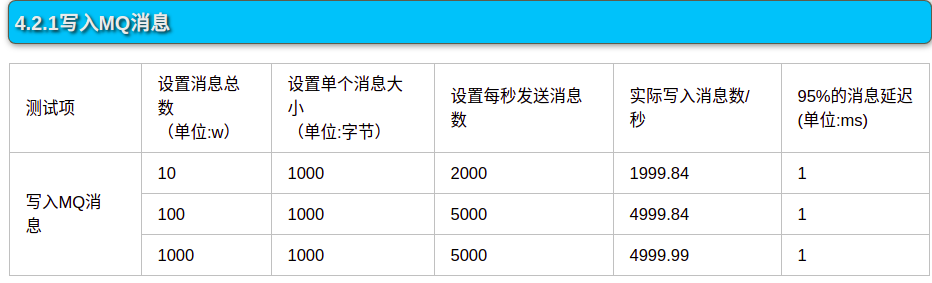
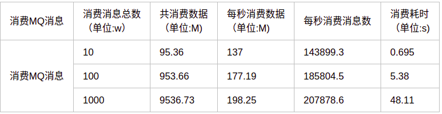

# 压力测试

## 文件格式说明

`[消息总数w]w[单个消息大小]byte[每秒发送消息数]mps[特殊说明/标记]`

## 图片说明

### 别人的测试结果

* 测试单点吞吐

    博客地址：[https://www.cnblogs.com/xiao987334176/p/10075659.html](https://www.cnblogs.com/xiao987334176/p/10075659.html)
    
    （1）生产
    
    
    
    （2）消费
    
    

* 如何找到 Kafka 集群的吞吐量极限？

    博客地址：[https://www.infoq.cn/article/AetfWCIUuacjctm_jYLe](https://www.infoq.cn/article/AetfWCIUuacjctm_jYLe)
    